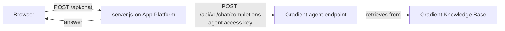

# doctl Support Bot

A support chatbot for [doctl](https://github.com/digitalocean/doctl) that answers from a
knowledge base which is kept current automatically.

- **Answering:** a DigitalOcean Gradient AI agent endpoint. The agent owns the knowledge base
  (hybrid lexical + semantic search over `docs/`) and generates the reply, so this service makes
  one call and holds one credential: that agent's access key. No DigitalOcean API token, no
  model access key, no KB UUID in the web tier.
- **Sources:** retrieved documents are not returned to the browser and are not cited in answers.
- **Hosting:** DigitalOcean App Platform. Deploy-on-push is deliberately off: the bot answers
  from the knowledge base, so new release notes never require a deployment. Only code changes
  do, and those are deployed explicitly.
- **Curation:** a DigitalOcean Managed Agent on a weekly cron reads new doctl release notes,
  updates `docs/` in this repo, regenerates the release index, pushes, syncs to Spaces and
  re-indexes the knowledge base. The running app is untouched by that run — the agent endpoint
  picks up the new content as soon as indexing finishes. The agent's tooling, spec and runbook live in the companion
  repo [managed-agents-kb-curator-demo](https://github.com/hgonzalez-do/managed-agents-kb-curator-demo);
  this repo is only the App Platform app plus the docs it answers from.

## Run locally

```sh
cp .env.example .env    # fill in DO_API_TOKEN, KB_UUID, MODEL_ACCESS_KEY
npm run dev             # http://localhost:8080
```

No dependencies: Node 20+ and the standard library only.

## Endpoints

| Method | Path            | Purpose |
|--------|-----------------|---------|
| GET    | `/`             | Chat UI |
| POST   | `/api/chat`     | `{message, history?}` → `{answer, model, usage, timing_ms}` |
| GET    | `/api/releases` | Machine-readable release index (`docs/release-index.json`) |
| GET    | `/api/health`   | Config sanity check |

## Configuration

| Variable | Required | Description |
|---|---|---|
| `AGENT_ENDPOINT` | yes | Gradient agent endpoint URL (`deployment.url`), e.g. `https://<id>.agents.do-ai.run`. |
| `AGENT_ACCESS_KEY` | yes | That agent's endpoint access key. Scoped to the one agent; not a DigitalOcean API token. |
| `AGENT_MODEL` | no | Sent as the request's `model` field, default `llama-4-maverick`. The agent's configured model is what answers. |
| `AGENT_MAX_TOKENS` | no | Completion cap, default 800. |
| `RELEASE_INDEX_URL` | no | Raw URL of `docs/release-index.json` on GitHub. Set it: `/api/releases` then serves the current index live (60 s cache) instead of the deploy-time snapshot in `docs/`, which never changes between deployments. Feeds the header badge only — answers always come from the knowledge base. |
| `PORT` | no | Default 8080. |

## Layout

```
server.js                     HTTP server: static UI + /api/* (retrieve → inference)
public/index.html             Chat UI
docs/                         The knowledge base content, maintained by the agent (see docs/README.md).
                              Source material for the Spaces -> knowledge-base pipeline, not
                              something the running app reads to answer questions.
```

## How a request flows


