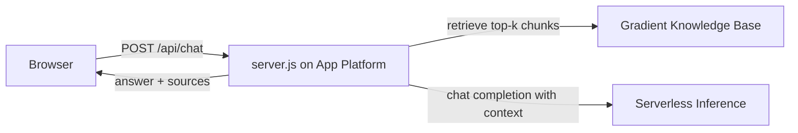

# doctl Support Bot

A support chatbot for [doctl](https://github.com/digitalocean/doctl) that answers from a
knowledge base which is kept current automatically.

- **Retrieval:** DigitalOcean Gradient Knowledge Base (hybrid lexical + semantic search over `docs/`).
- **Generation:** DigitalOcean Serverless Inference (OpenAI-compatible, any catalog model).
- **Hosting:** DigitalOcean App Platform (deploys on push from this repo).
- **Curation:** a DigitalOcean Managed Agent (Claude Code) on a weekly cron reads new doctl
  release notes, updates `docs/`, regenerates the release index, pushes, syncs to Spaces and
  re-indexes the knowledge base.

Deployment scripts, the agent spec and the demo walkthrough live in the companion repo
[managed-agents-kb-curator-demo](https://github.com/hgonzalez-do/managed-agents-kb-curator-demo).

## Run locally

```sh
cp .env.example .env    # fill in DO_API_TOKEN, KB_UUID, MODEL_ACCESS_KEY
npm run dev             # http://localhost:8080
```

No dependencies: Node 20+ and the standard library only.

## Endpoints

| Method | Path            | Purpose |
|--------|-----------------|---------|
| GET    | `/`             | Chat UI |
| POST   | `/api/chat`     | `{message, history?}` → `{answer, sources, model, usage, timing_ms}` |
| GET    | `/api/releases` | Machine-readable release index (`docs/release-index.json`) |
| GET    | `/api/health`   | Config sanity check |

## Configuration

| Variable | Required | Description |
|---|---|---|
| `DO_API_TOKEN` | yes | DO API token with the **GenAI read** scope. Used for knowledge-base retrieval only. |
| `KB_UUID` | yes | Gradient Knowledge Base UUID. |
| `MODEL_ACCESS_KEY` | yes | Serverless Inference model access key. |
| `INFERENCE_MODEL` | no | Chat model ID, default `anthropic-claude-haiku-4.5`. |
| `KB_NUM_RESULTS` / `KB_ALPHA` | no | Retrieval depth (default 6) and lexical/semantic balance (default 0.5). |
| `RELEASE_INDEX_URL` | no | Raw URL of `docs/release-index.json` on GitHub; when set, `/api/releases` serves it live (60 s cache) instead of the copy baked into the deploy. |
| `PORT` | no | Default 8080. |

## Layout

```
server.js                     HTTP server: static UI + /api/* (retrieve → inference)
public/index.html             Chat UI
docs/                         The knowledge base content (see docs/README.md)
scripts/releases.py           fetch | bootstrap | index | rewind release docs
scripts/sync-docs-to-spaces.sh  docs/ → Spaces bucket (agent step)
scripts/reindex-kb.sh           start + wait for a KB indexing job (agent step)
```

## How a request flows


